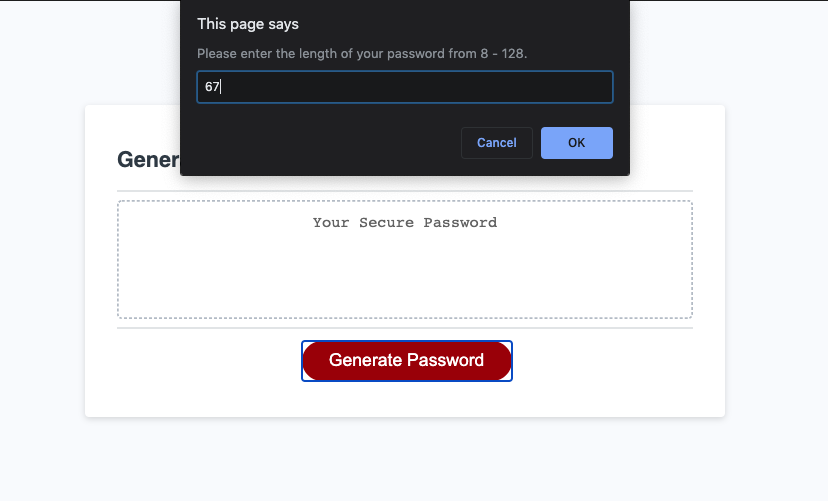
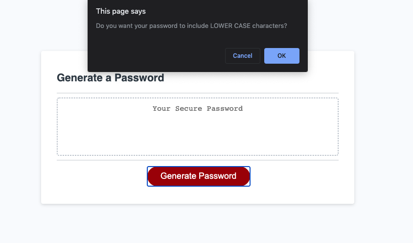
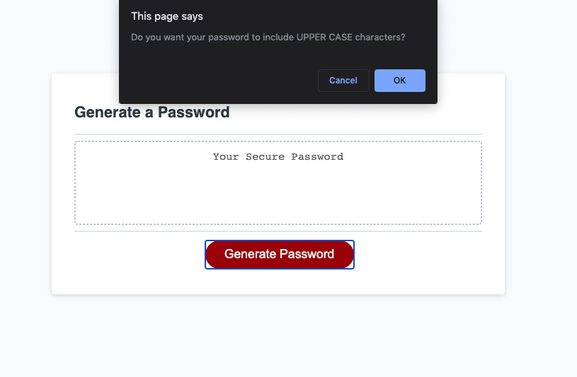
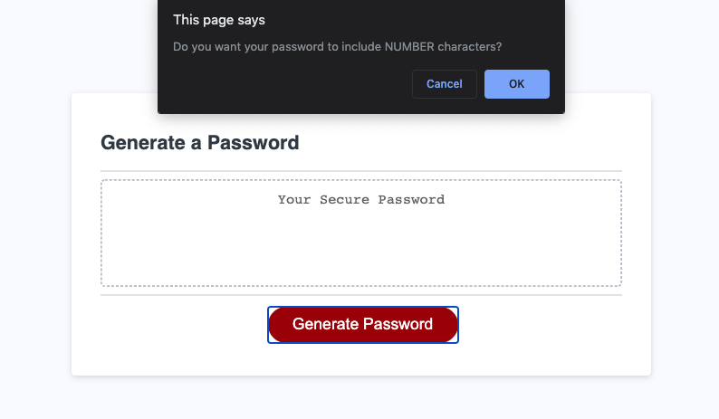
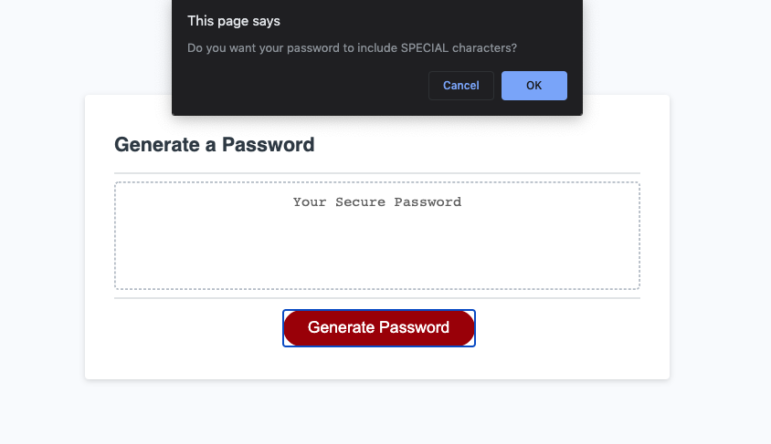
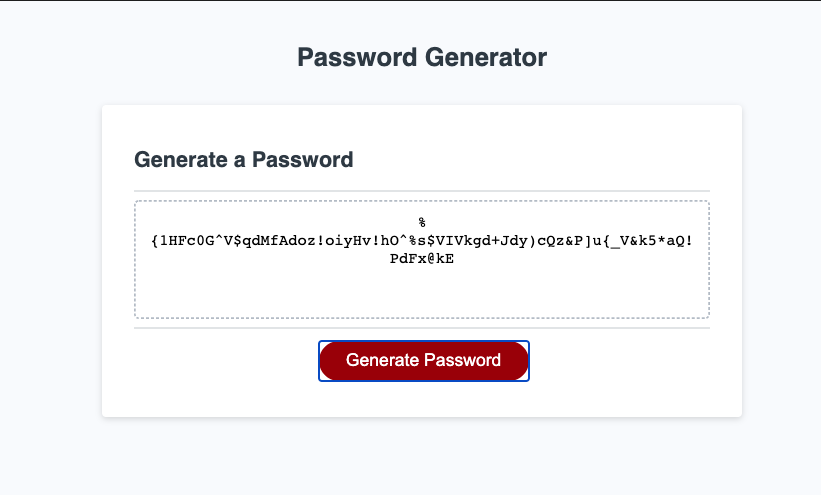

# Password-Generator

Deployed Link: https://arjaesj.github.io/Password-Generator

Generates a strong password with user preferred criterion/criteria.
User will be alerted for the following:

1. length of password - minimum of 8 characters up to 128 max
2. lower case alphabets inclusion
3. upper case alphabets inclusion
4. numeric characters inclusion
5. special characters inclusion

Password Generator Screenshots:

Length prompt

Lowercase prompt

Uppercase prompt

Number prompt

Special Characters prompt

Generated Password Sample

